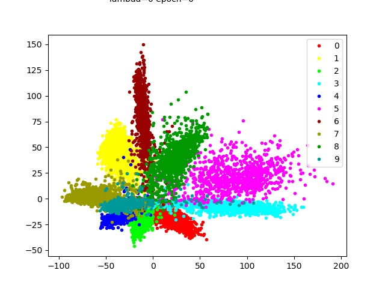
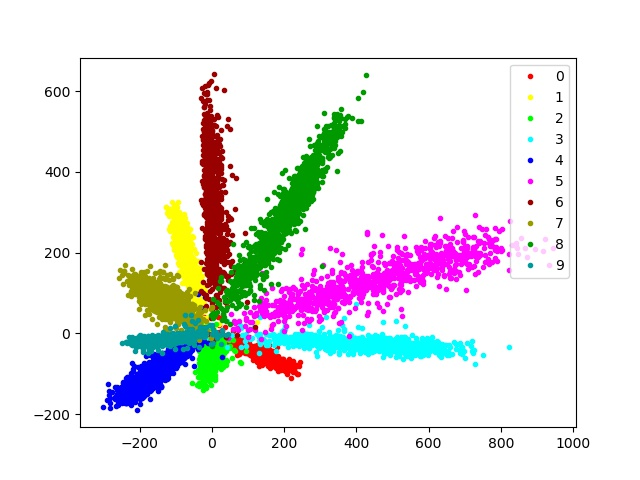
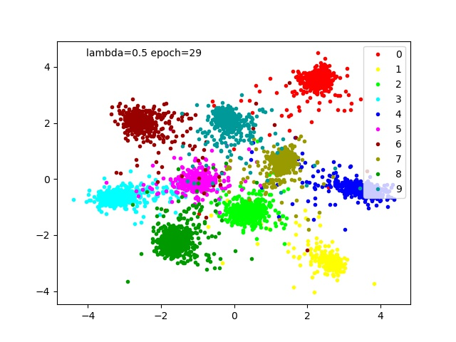

# Center Loss Visualization on MNIST datasets

## Purpose: Observe the cluster influenced by center loss

一般做多類別分類時都會使用 Softmax 當作輸出，Crossentropy 當作 loss function 來訓練模型的參數。這種做法有個缺點就是分類會太過自信，另外某些情況下我們更關心透過 NN 是否能提取出好的 feature。可惜的是直接利用 Softmax + Crossentropy 來訓練模型所得到的 feature 並不一定會有 cluster 的效果。

所以希望藉由這次的實驗，可以利用 Softmax + Crossentropy + center loss 的方式來訓練模型參數，解決 Softmax 過度自信，並透過增加 center loss 的概念提取具有cluster 特性的 feature。

## Data 簡介

MNIST datasets 包含從零到九的手繪數字的灰度圖像。

每張圖像的高度為28像素，寬度為28像素，總共為784像素。 每個像素都有一個與之相關的像素值，表示該像素的亮度或暗度，較高的數字意味著較暗。 此像素值是一個介於0和255之間的整數，包括0和255。

* train.csv: 訓練數據集有785行，其中第一列是由用戶繪製的數字，也就是標籤。其餘列包含關聯圖像的像素值。

* test.csv: 跟 train.csv 是一樣的，只是缺少了第一行標籤的訊息。

## Summary

在使用 Softmax 當作輸出層數學式為 Softmax(Wx + b)，我們可以理解 x 為資料經過 NN 所提取出來的 feature，而這個 feature 會有什麼特性呢?

仔細想想利用 Softmax + Crossentropy 來訓練模型只可以將每筆資料盡量歸到他所屬的類別，但卻不能使不同類別間的距離擴大，造成這種結果的主要原因是因為 exp 函數會使得數值大者恆大小者恆小，以至於最大的值機率會很接近1。因此解由此方式訓練模型並不一定會得到 cluster 效果的 feature。loss function 數學式如下，

<a href="https://www.codecogs.com/eqnedit.php?latex=-\sum_{i=1}^{m}log\frac{e^{W_{y}^{T}x&plus;b_{y}}}{\sum_{j=1}^{n}e^{W_{j}^{T}x&plus;b_{j}}}" target="_blank"></a>

然而對 loss function 增加 center loss 的概念可以使每筆資料盡量歸到他所屬的類別並且擴大不同類別之間的距離，進而影響模型提取出具有 cluster 效果的 feature。loss function 數學式如下，

<a href="https://www.codecogs.com/eqnedit.php?latex=-\sum_{i=1}^{m}log\frac{e^{W_{y}^{T}x&plus;b_{y}}}{\sum_{j=1}^{n}e^{W_{j}^{T}x&plus;b_{j}}}&plus;\lambda&space;\left&space;\|&space;x-c_{y}&space;\right&space;\|" target="_blank"></a>

本次假設 x 的維度為2維，以利後續作視覺化的呈現，<a href="https://www.codecogs.com/eqnedit.php?latex=\lambda&space;=0.5" target="_blank"></a>。下圖左邊兩張圖為 NN 單純使用 Softmax + Crossentropy 的方式所訓練出來的 feature。左上為經過一次 epoch 所得到 feature。左下則經過30個 epoch 所獲得的 feature。清楚的知道 feature 從一開始混在一起，到後來各類別似乎都已某個中心點向外延伸。這也清楚的說明這樣的訓練方式只會使資料盡量被歸到所屬的類別，不能夠將不同的類別的距離拉開。

右邊兩張圖則加入 center loss 概念的結果。右上為經過一次 epoch 所得到 feature。右下則經過30個 epoch 所獲得的 feature。從途中可以得知經過30個 epoch 之後，各類別分別聚集成一團，彼此分開，這也再次說明 center loss 可以幫助我們訓練出一個具有 cluster 特性的 feature 。我相信如果訓練的 epoch 夠多的話，一定可以將資料區分得更清楚。

<div class="half">
    
    
    
    
</div>


## File Stucture

```
01-CenterLossVisualization
|    README.md
|    main.py
|
└─── Base
|      __init__.py
|      Utility.py
|      Model.py
|      Train.py
|
└─── 01-RAWData
|       train.csv
|       test.csv
|
└─── 02-Output
|       IsCenter
|         lambda=0.0epoch=0.jpg
|         lambda=0.0epoch=1.jpg
|         ...
|
|       NonCenter
|         epoch=0.jpg
|         epoch=1.jpg
|         ...
|___
```

## Reference

* [Keras中自定義復雜的loss函數](https://kexue.fm/archives/4493)

* [Keras callbacks guide and code](https://keunwoochoi.wordpress.com/2016/07/16/keras-callbacks/)

* [【Technical Review】ECCV16 Center Loss及其在人臉識別中的應用](https://zhuanlan.zhihu.com/p/23340343)

* [MNIST center loss pytorch](https://github.com/jxgu1016/MNIST_center_loss_pytorch)