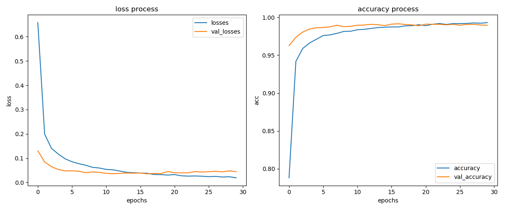
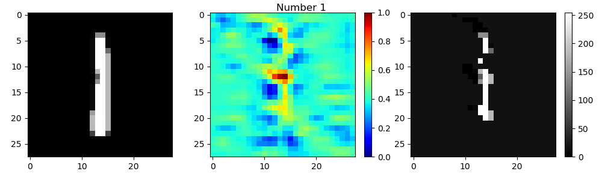
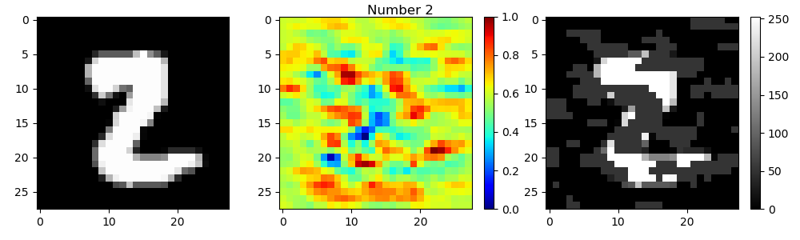
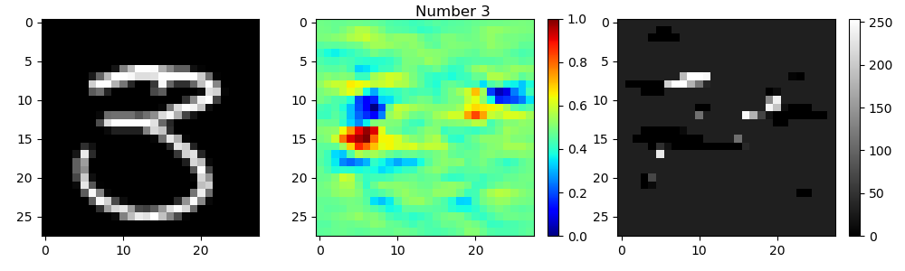
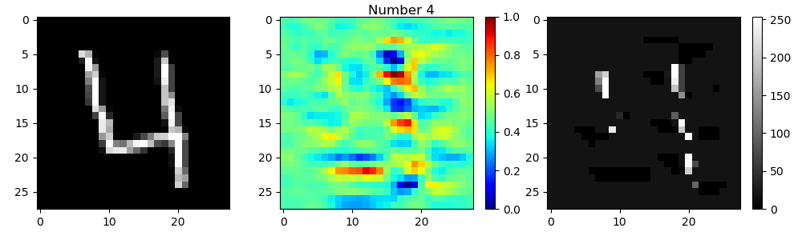
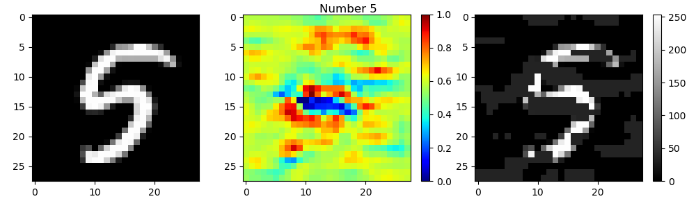
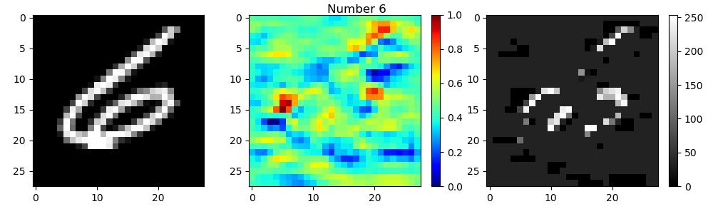
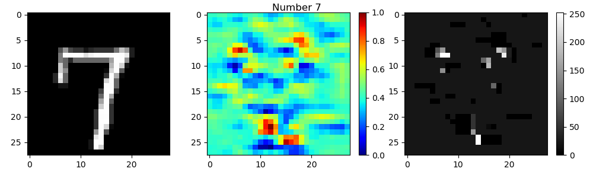
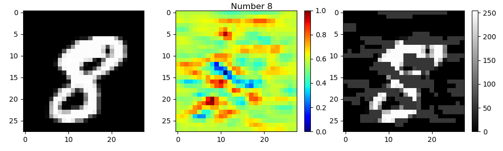
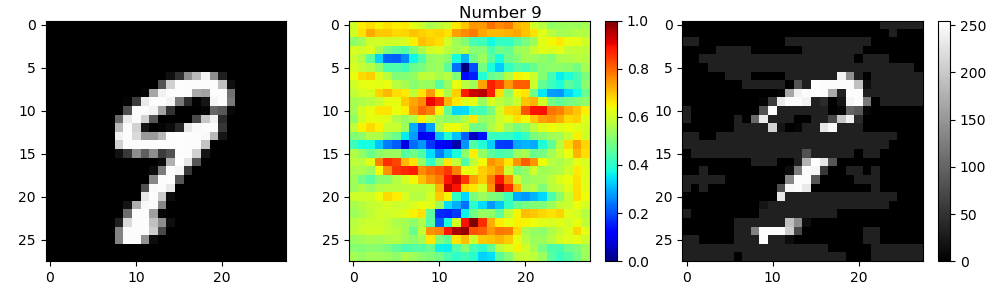

# Digit Recognizer

## Purpose: Handwritten Image Classification

這個競賽主要目的是手寫數字照片分類，總共有10種可能的數字(0 ~ 9)。

希望利用 training dataset 訓練一個 CNN model，預測出每張圖片的數字 label。

## Data 簡介

MNIST datasets 包含從零到九的手繪數字的灰度圖像。

每張圖像的高度為28像素，寬度為28像素，總共為784像素。 每個像素都有一個與之相關的像素值，表示該像素的亮度或暗度，較高的數字意味著較暗。 此像素值是一個介於0和255之間的整數，包括0和255。

* train.csv: 訓練數據集有785行，其中第一行是由用戶繪製的數字，也就是標籤。其餘列包含關聯圖像的像素值。共有 42000 筆資料

* test.csv: 跟 train.csv 是一樣的，只是缺少了第一行標籤的訊息。共有 28000 筆資料

## Summary
# TODO:

首先將 training data 進行標準化，並取出最後 10% 資料當作 validation data (大約4200筆)。

這次所使用的模型結構相對簡單，模仿 VGG 模型，整體使用的卷積核都比較小（3×3），3×3是可以表示「左右」，「上下」，「中心」這些模式的最小單元了。前面幾層是卷積層的堆疊，然後用一層用全連接層，最後是 SOFTMAX 層。所有隱層的激活單元都是 RELU。模型總參數數量為 117,434。

- Conv2D() : 保留了圖片水平、垂直、color channel 等三維的相對資訊
- Activation() : 均使用 Relu，可以避免運算結果趨近 0 或無限大
- MaxPooling2D() : 池化是一個壓縮圖片並保留重要資訊的方法，原圖經過池化以後，其所包含的像素數量會降為原本的四分之一，但因為池化後的圖片包含了原圖中各個範圍的最大值，它還是保留了每個範圍和各個特徵的相符程度。也就是說，池化後的資訊更專注於圖片中是否存在相符的特徵，而非圖片中哪裡存在這些特徵。這能幫助 CNN 判斷圖片中是否包含某項特徵，而不必分心於特徵的位置
- Dropout() : dropout rate 為 0.5，避免模型過擬和

由於資料集相當乾淨，不論是 training accuracy 還是 validation accuracy ，模型經過 2~3 個 epoch，accuracy 就已經達到 90% 以上的精準度。training loss 隨著 epoch 越來越多次越接近 0。但 validation loss 大約在第 10 次 epoch 之後就一直維持在 0.04 左右。

<div class="half">
    
</div>

## Confusion Matrix

## Saliency Map




















## Visualizing Filters

<div class="half">
    
    
    
    
</div>

## File Stucture

```
02-Kaggle-DigitRecognizer
|    README.md
|    main.py
|    Test.py
|
└─── Base
|      __init__.py
|      DataProcessing.py
|      Predict.py
|      Utility.py
|      Model.py
|      Train.py
|
└─── 01-RAWData
|       train.csv
|       test.csv
|       sample_submission.csv
|
└─── 02-Output
|       submission.csv
|       01Train
|         log.csv
|         LossAccuracyCurves.png
|         model.h5
|
|       02Test
|         log.csv
|         LossAccuracyCurves.png
|         model.h5
|___
```

## Reference

* [Digit Recognizer](https://www.kaggle.com/c/digit-recognizer)
