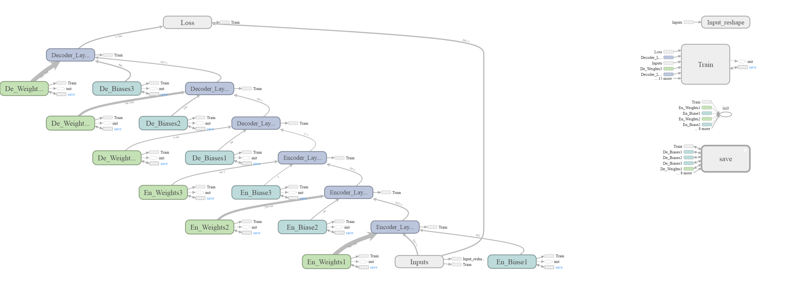
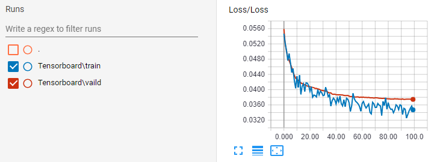
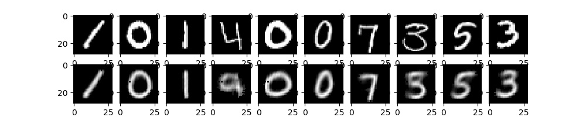
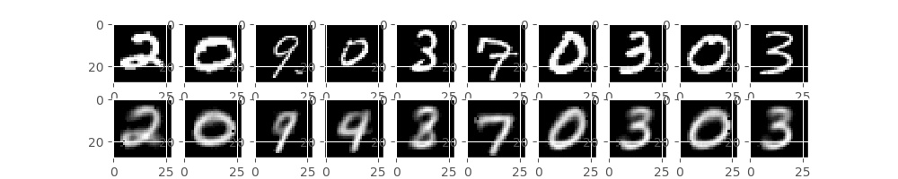
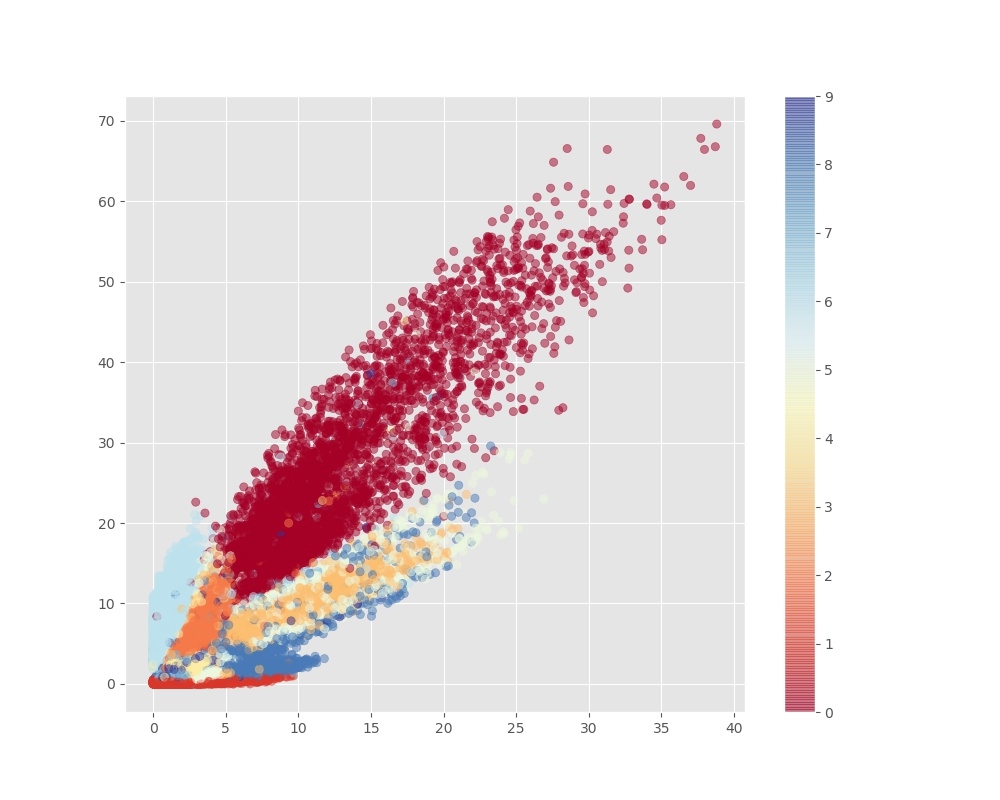

# AutoEncoder

## Purpose: Reconstruct Handwritten Image

這個 project 主要透過實作來了解 Autoencoder 是如何運行。將 Autoencoder 運用在 MNIST dataset。

## Data 簡介

MNIST datasets 包含從零到九的手繪數字的灰度圖像。

每張圖像的高度為 28 像素，寬度為 28 像素，總共為 784 像素。 每個像素都有一個與之相關的像素值，表示該像素的亮度或暗度，較高的數字意味著較暗。 此像素值是一個介於 0 和 255 之間的整數，包括 0 和 255。

* train.csv: 訓練數據集有 785 行，其中第一行是由用戶繪製的數字，也就是標籤。其餘列包含關聯圖像的像素值。共有 42000 筆資料

* test.csv: 跟 train.csv 是一樣的，只是缺少了第一行標籤的訊息。共有 28000 筆資料

## Summary

Autoencoder 概念很簡單，主要就是資訊的壓縮。主要概念是，透過 Encoder 逐步的將資料壓縮，然後留下最精華 code 的部分，最後透過 Decoder 逐步地將資料還原。另外在一層當中使用神經元愈多，可以儲存的資訊量也就愈多，相反的神經元越少，可以儲存的資訊量越少。

不論是 Encoder 或是 Decoder，其實就是 Neurel Network，所以可以透過設定目標函數來來更新 NN 中所含的權重。整個 Autoencoder 的目標函數就是去最小化原始 image 和 reconstruct image 之間的差異。

Encoder 主要功能為將原始圖片壓縮成 code，其實就是做 Dimension Reduction，而這個 code 包含 image 中重要的資訊，也是在這個新的維度下的座標，另外我們也可以透過這個 code 來衡量資料資間的相似程度。Decoder 主要為將 code 重新還原成 image。

模型架構如下面所示:



下圖為 Loss curve，其中藍色為 trainig，橘色為 vaild。



我們會透過整個 Autoencoder 來觀察 image 經過 Eencoder 壓縮成 code，在經過 Decoder 解壓還原的 image 和原來 image 之間的差異。

下圖為將 training image 重建的結果，可以發現一些筆畫比較簡單的數字重建效果還不錯 ex:1 , 0。至於其他數字就有典糢糊，4重建效果就很差。代表這模型還有很多地方需要改善。



下圖將 testing image 重建的結果，整體效果還不錯，但 0 和 9 對模型來說可能就會搞混。



另外也會藉由視覺化的方式來呈現 image 經過獨使用 Encoder 所得到的 code 之間的分布狀況。如下圖所示:



因為 activation 都選用 relu 導致出來的數值都大於 0，另外每個類別的區分以大方向來說還算可以，但各類別之間就沒有很明顯，或許可以利用增加 [Center Loss](https://github.com/machineCYC/SideProjects/tree/master/01-CenterLossVisualization) 的概念還補強這狀況。


## File Stucture

```
04-AutoEncoder/
|    README.md
|    train.py
|    visulization.py
|
└─── Tensorboard/
|      train/
|         xxxxxxx.ASUS
|      vaild/
|         xxxxxxx.ASUS
|
└─── Base/
|      __init__.py
|      DataProcessing.py
|      Model.py
|      Utility.py
|
└─── 01-RAWData/
|       train.csv
|       test.csv
|       sample_submission.csv
|
└─── 02-Output/
|       AutoEncoder.data-00000-of-00001
|       AutoEncoder.index
|       AutoEncoder.meta
|       checkpoint
|       main_graph.png
|       recons_Test.jpg
|       recons_Train.jpg
|       2dim_train.jpg
|___
```