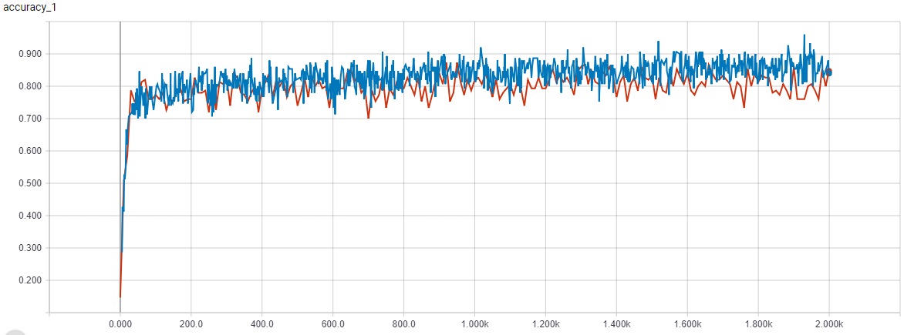
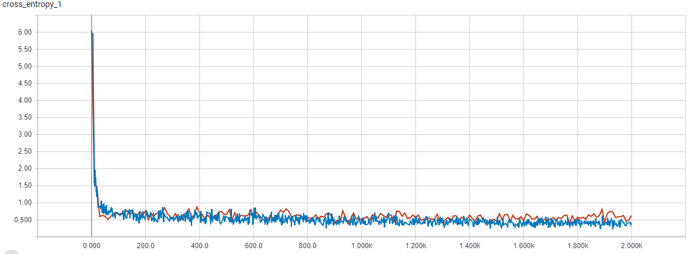

# Transfer Learning

## Purpose: Fine-tuning the last layer with pretrained model

這個 project 主要透過實作來了解 transfer learning 是如何運行。這次嘗試利用 ImageNet 中的模型 Inception-V3 來 fine tuning 最後一層 layer。最後將 Transfer learning 運用在 cifar-10 dataset。

## Data 簡介

cifar-10 datasets 共有 60000 張彩色圖片，每張彩色圖像的高度為 32 像素，寬度為 32 像素。

包含 "plane", "car", "bird", "cat", "deer", "dog", "frog", "horse", "ship", "truck" 共 10 個類別。每個類別有 6000 張照片。

如果沒有資料可以透過 src/download_data.py 來下載原始資料並轉成我們所需要的格式，執行完會出現兩個資料夾 data/train, data/train2。

* data/train: 將原始圖片依照類別分開儲存

* data/train2: 將圖片依照類別分開儲存。另外如果使用 data augmentation 的化會在資料夾生成更多圖檔

## Summary

由於 cifar-10 datasets 的類別有部分出現在 ImageNet 中的類別，加上資料總共有 60000 張圖片。因此採用 fine-tunung 的概念來嘗試。

Fine-tunung 概念很簡單，主要就是採用別人已經訓練好的模型，重新訓練特定 layer 的參數。本次是固定前面捲積層的 layer，藉此來當 feature extractor 。而只要去訓練一個分類器，通常只會訓練最後一層來做分類器或者是其他的分類模型。

下圖為 Accuracy rate curve，其中藍色為 trainig，橘色為 vaildation。



下圖為 Loss curve，其中藍色為 trainig，橘色為 vaildation。



由上面兩張圖可以清楚的知道，大約在 100 個 iterations 模型就趨於穩定，不論是 accuracy 或是 loss 變化都不太明顯。透過調整 iteration 的次數和 learning rate decay 的 step，模型極限大約就是 accuracy rate 81%。

未來要改善模型的能力可以從模型的結構，像是訓練更多層的 layer 或者重新 train 一個相對較小的模型。另外也可以嘗試 data augmentation 的手法 通常對於 accuracy rate 都會有明顯的提升。

單純訓練模型後面 fully connection layer 的方法有個好處就是不太需要 GPU，而 transfer learning 相對於重新 train 一個模型所需要的硬體資源也會比較少。

## Note

1.由於只 train 最後一層 layer，導致模型能力備受限。嘗試調整 learning rate inti (0.1, 0.01) 和 learning rate decay 中的 step rate (50, 65, 80, 100) ，accuracy rate 極限似乎是 81%。

2.tensorboard 語法 tensorboard --logdir=tmp/retrain_logs/train/, tmp/retrain_logs/validation/


## File Stucture

```
04-TransferLearning/
|    .gitignore
|    README.md
|    main.py
|
└─── src/
|      __init__.py
|      File.py
|      model.py
|      common.py
|      download_data.py
|
└─── tmp/
|       bottleneck/
|       imagenet/
|       retrain_logs/
|
|
└─── data/
|       train/
|       train2/
|___
```

# Reference

* [Tensorflow Graph](https://zhuanlan.zhihu.com/p/31308381)

* [Transfer Learning: retraining Inception V3 for custom image classification](https://becominghuman.ai/transfer-learning-retraining-inception-v3-for-custom-image-classification-2820f653c557)

* [cs231: Transfer learning](http://cs231n.github.io/transfer-learning/)