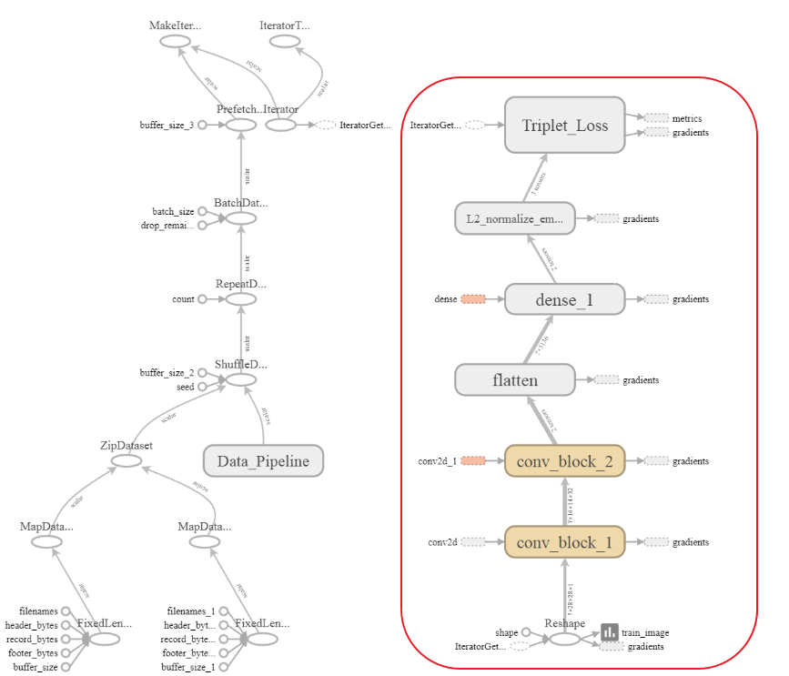
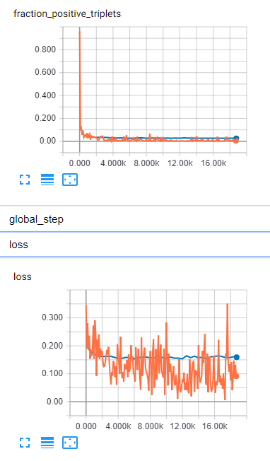
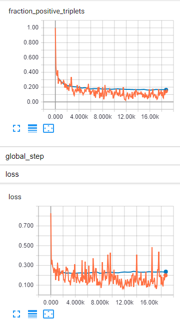
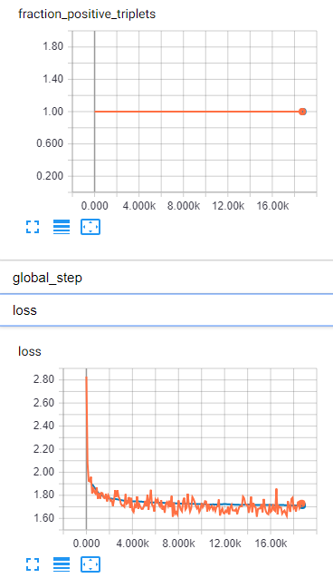
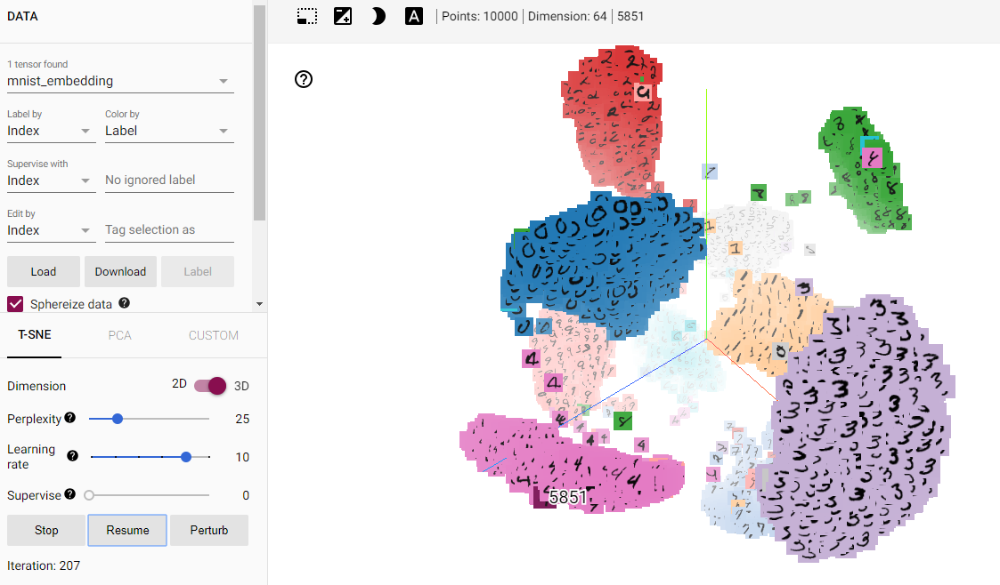
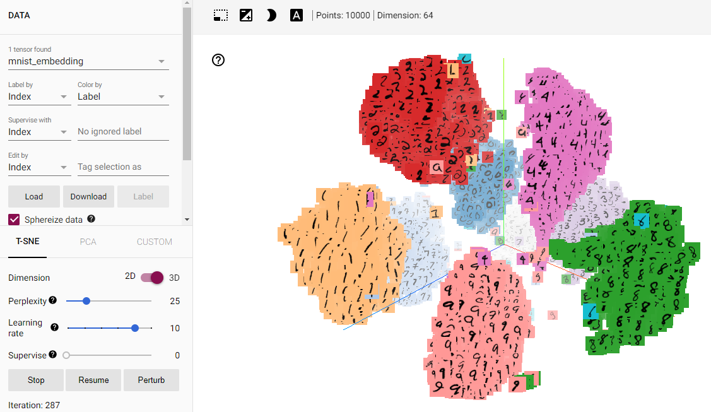
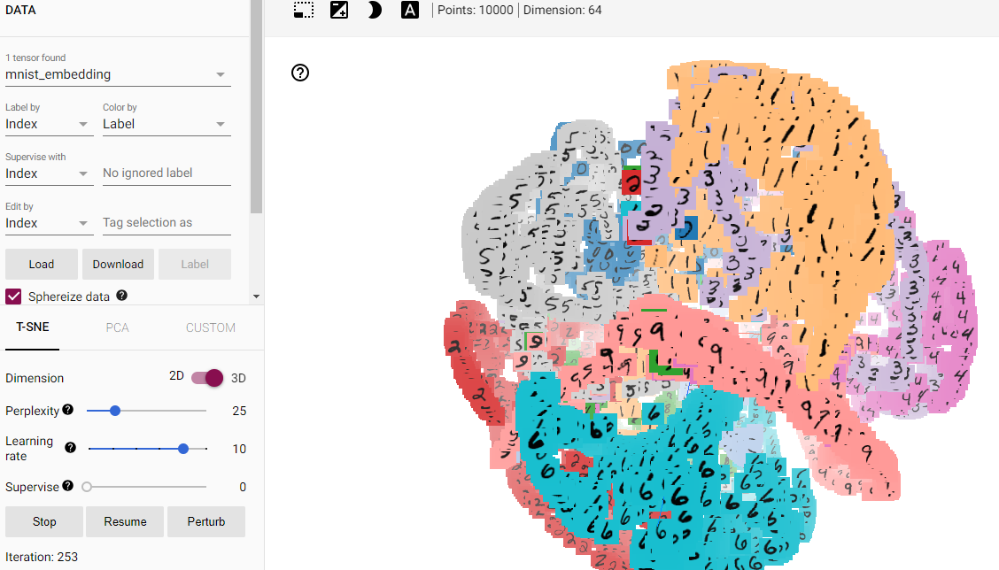

# Triplet Loss Visualization on MNIST datasets

## Purpose: Observe the cluster influenced by triplet loss

一般做圖片多類別分類的常見方法為，建立一個捲積網絡，Softmax 當作輸出，Crossentropy 當作 loss function 來訓練模型的參數。而這種方法有個缺點就是當要新增一個類別的時候，必須要重新訓練模型。最常見的例子就是人臉辨識系統，資料庫中的使用者會一直改變 (人員會增加或減少)，採用此方式在人員增加或減少時就會造成許多困擾。

由此可知這種訓練方式，模型的擴充能力相當不足。因此衍生出 embedding 的概念，及將圖片 mapping 到歐式空間中的向量，最後在藉此向量來衡量彼此是否相似。這種方式仰賴的 loss function 跟一般認知的不太相同。而是一種 triplet loss。

所以希望藉由這次的實驗，可以了解 triplet loss 的概念和訓練流程，並透過 tensorflow 中的 projector 將 embedding 視覺化呈現(t-sne)。

## Data 簡介

MNIST datasets 包含從零到九的手繪數字的灰度圖像。

每張圖像的高度為 28 像素，寬度為 28 像素，總共為 784 像素。 每個像素都有一個與之相關的像素值，表示該像素的亮度或暗度，較高的數字意味著較暗。 此像素值是一個介於 0 和 255 之間的整數，包括 0 和 255。

* training set: 60000 筆
* testing set: 10000 筆

## Summary

Triplet loss 主要的目的是讓相同類別的資料在 embedding space 中盡可能地接近，而不同類別的盡可能地遠。

Triplet loss 概念和說明如下:

- anchor: 以此樣本和其類別為基準
- positive: 與 anchor 擁有相同類別，但不同筆資料
- negative: 與 anchor 不同類別的資料

計算 triplet loss 需要有兩個相同類別的樣本(anchor、positive)，與一個不同類別的樣本(negative)。

進一步，我們希望 anchor 和 positive 的距離小於 anchor 和 negative 的距離。但這數學式 <a href="https://www.codecogs.com/eqnedit.php?latex=d(a,&space;p)&space;\leq&space;d(a,&space;n)" target="_blank"></a> 可能會導致模型在訓練過程中創造出 <a href="https://www.codecogs.com/eqnedit.php?latex=a=p=n=0" target="_blank"></a>。

因此在原先的數學式中加上 margin(類似 SVM) 的概念。使得 <a href="https://www.codecogs.com/eqnedit.php?latex=d(a,&space;p)&space;&plus;&space;\alpha&space;\leq&space;d(a,&space;n)" target="_blank"></a> 

最後 triplet loss 的計算方式如下:

<a href="https://www.codecogs.com/eqnedit.php?latex=L(a,p,n)&space;=&space;max\left&space;(&space;d(a,&space;p)&space;&plus;&space;\alpha&space;-&space;d(a,&space;n),&space;0&space;\right&space;)" target="_blank"></a>


在 anchor、positive 和 negative 的選擇上有很多種方法。主要可分為 offine triplet mining 和 online triplet mining。而 offine triplet mining 的方法訓練和選擇 anchor、positive、negative 是拆開的，所以相對沒效率。online triplet mining 則是在每個 batch data 中進行選擇。細節可以參考 reference 的文章。在這次實驗中都是以 online 為主。

在這次實驗中，主要是透過 cnn 模型將 mnist data 投影至 embedding space，模型如下圖紅框處。

<div class="center">
    
</div>

下列將實驗的結果統整如下

- triplet_strategy: 指的是使用何種方法找出 anchor、positive 和 negative
- fraction_positive: 在使用 batch_all 的方法找出 anchor、positive 和 negativ 時，可以去觀察每組 batch data 中 tiplet loss 大於 0 在有效的 triplet 中所佔的比例

| model | margin | triplet_strategy | fraction_positive(train) | fraction_positive(valid) | loss(train) | loss(valid) |
| --- | --- | --- | --- |--- |--- |--- |
| 2018-10-14-100444 | 0.5 | batch_all | 0.0054673 | 0.02537 | 0.09122 | 0.1592 |
| 2018-10-14-105153 | 1 | batch_all | 0.1446 | 0.1627 | 0.1997 | 0.2367 |
| 2018-10-14-125311 | 3 | batch_all | 1.0 | 1.0 | 1.730 | 1.713 |

<div class="center">
    
    
    
</div>

<div class="center">
    
    
    
</div>

## Note

1. tf.estimator.train_and_evaluate eval 似乎是在被 save_checkpoints_steps 所觸發
2. conv_block 兩個跟三個效果差異不大
3. 單純更改 batch size 64 --> 128，效果也不明顯
4. margin(3, 5) 太大，雖然 loss下降得很好，但在每個 batch 中，再有效的 triplet 中 100% loss 都會大於 0

## File Stucture

```
05-TripletLossVisualization/
|    .gitignore
|    README.md
|    train.py
|    visulization.py
|
└─── experiments/
|      naive_cnn/
|        params.json
|        2018-10-
|        2018-10- -embedding
|
└─── src/
|      __init__.py
|      utils.py
|      create_metadata_tsv.py
|      create_sprite_image.py
|      load_data.py
|
└─── model/
|      __init__.py
|      triplet_loss.py
|      model_fn.py
|
|
└─── data/
|      MNIST_data/
|       
|___
```

# Reference

* [Facenet](https://blog.csdn.net/qq_15192373/article/details/78490726)

* [Triplet Loss Example(keras)](https://github.com/SpikeKing/triplet-loss-mnist)

* [Triplet blog](https://omoindrot.github.io/triplet-loss)

* [Tensorflow Estimator](https://zhuanlan.zhihu.com/p/33681224)

* [Tensorboard Embedding](https://www.jianshu.com/p/d5339d04aa17)